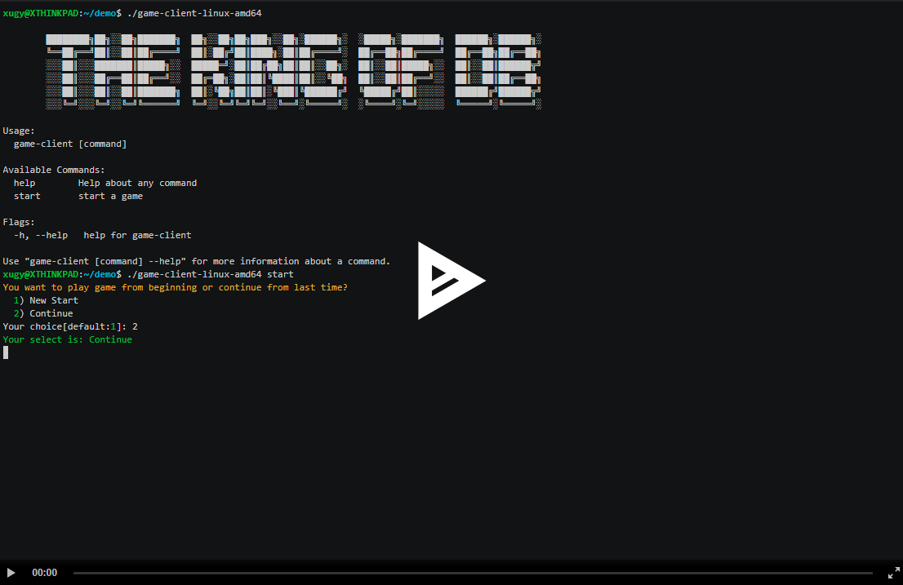

```
      ████████╗██╗░░██╗███████╗  ██╗░░██╗██╗███╗░░██╗░██████╗░  ░█████╗░███████╗  ██████╗░██████╗░
      ╚══██╔══╝██║░░██║██╔════╝  ██║░██╔╝██║████╗░██║██╔════╝░  ██╔══██╗██╔════╝  ██╔══██╗██╔══██╗
      ░░░██║░░░███████║█████╗░░  █████═╝░██║██╔██╗██║██║░░██╗░  ██║░░██║█████╗░░  ██║░░██║██████╦╝
      ░░░██║░░░██╔══██║██╔══╝░░  ██╔═██╗░██║██║╚████║██║░░╚██╗  ██║░░██║██╔══╝░░  ██║░░██║██╔══██╗
      ░░░██║░░░██║░░██║███████╗  ██║░╚██╗██║██║░╚███║╚██████╔╝  ╚█████╔╝██║░░░░░  ██████╔╝██████╦╝
      ░░░╚═╝░░░╚═╝░░╚═╝╚══════╝  ╚═╝░░╚═╝╚═╝╚═╝░░╚══╝░╚═════╝░  ░╚════╝░╚═╝░░░░░  ╚═════╝░╚═════╝░
```

# Adventure  [](https://opensource.org/licenses/MIT)


Adventure is a simple RPG online game to meet all your fantasy if you become the
dominator of the code.

## Secret to Play

There are 2 options to have fun:
  - CLI - download from [here](https://github.com/new-adventure-aerolite/game_client/releases)
  - Web UI - Temporary online server is at [here](https://rpg-game.eastus.cloudapp.azure.com/)

### When your boss sits next to you

Just pretend you are typing in your terminal.

Click the below figure for a recorded playback.

[](https://asciinema.org/a/404325)

### When your boss is not in the office

Just play it in your web browser:


The full stack code contains projects casacading from UI to container platform
creation and management (by [Terraform](https://www.terraform.io/) and [FluxCD](https://fluxcd.io/)).

## Projects

The children projects are:
  - Web the `Frontend` UI: [game-frontend](https://github.com/new-adventure-aerolite/game-frontend)
  - Game main the `App` server: [grpc-app-server](https://github.com/new-adventure-aerolite/grpc-app-server)
  - Authentication the `Auth` server: [grpc-auth-server](https://github.com/new-adventure-aerolite/grpc-auth-server)
  - Engine the `Fight` server: [grpc-auth-server](https://github.com/new-adventure-aerolite/grpc-fight-server)
  - Game CLI Client: [game-cli](https://github.com/new-adventure-aerolite/game_client)
  - Infrastructure the `GitOps` repository: [this repository](https://github.com/new-adventure-aerolite/adventure)

## Architecture

The overall funny architecture is as the below figure illustrates:


*Fig-1 The Architecture*

The term of `dominator` stands for the developer creates all of code
include IAC (Infrastructure-As-Code), Kubernetes workload manifests and
all runtime (orange colored rectange from the above figure) code.

### Additional Offerings

As multiple add-on is in the infrastructure stack, they offers some basic
operation friendly features:

1. Istio's distributed tracing. The span can be propagated from
   Istio ingress gateway to each PostgreSQL's call.
2. The CNPO (Cloud Native Postgres Operator) creates and manages one HA
   PG clusters.
3. Prometheus and Grafana are configured to scrape the istio-proxy's
   telemetry and present them in pre-defined form.
4. Dex is used as identity service, which could be configured as client
   application and connect to different IDPs(Identity Provider).
5. Canary deployment of fight-servers: player from the `admin` team
   (on Github game organization) is routed to fight-server workload with
   special treat to win every round of fight.

## Questions

Just create issues.

## This is my work tree

hello I will file a PR later
